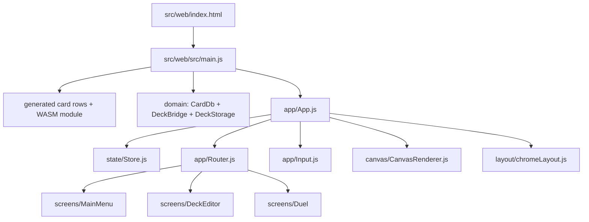
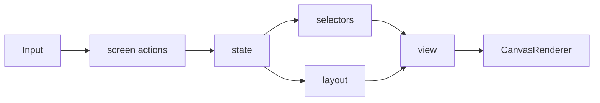

# OpenJoey2

OpenJoey2 is a Yu-Gi-Oh-style duel prototype with a browser canvas UI backed by
a C++ rules core compiled to WebAssembly.

The browser app lives in `src/web`. Card data parsing, searching, display
formatting, deck storage, and generated card rows are JavaScript-owned. C++ owns
deck and duel mechanics only; JavaScript forwards compact card fields into WASM.

## Repository Layout

```text
.
├── CMakeLists.txt
├── OpenJoey2.sh
├── README.md
├── data/
└── src/
    ├── cpp/
    │   ├── WasmApi.cpp
    │   ├── NativeSmoke.cpp
    │   ├── card/
    │   │   └── Card.hpp
    │   ├── duel/
    │   ├── effect/
    │   └── field/
    ├── tools/
    │   ├── browser-smoke.js
    │   └── generate-card-db.js
    └── web/
        ├── index.html
        └── src/
            ├── main.js
            ├── app/
            │   ├── App.js
            │   ├── Router.js
            │   └── Input.js
            ├── state/
            │   ├── Store.js
            │   ├── deckState.js
            │   └── duelState.js
            ├── domain/
            │   ├── CardDb.js
            │   ├── DeckBridge.js
            │   ├── DeckStorage.js
            │   └── generated/
            │       ├── cardRows.generated.js
            │       ├── openJoeyCore.generated.js
            │       └── openJoeyCore.generated.wasm
            ├── canvas/
            │   ├── CanvasRenderer.js
            │   ├── primitives.js
            │   └── hitTest.js
            ├── layout/
            │   ├── chromeLayout.js
            │   ├── deckEditorLayout.js
            │   └── duelLayout.js
            ├── screens/
            │   ├── MainMenu/
            │   ├── DeckEditor/
            │   └── Duel/
            └── assets/
```

## Workflow

```mermaid
flowchart LR
  Json["data/cards.json"]
  Generator["src/tools/generate-card-db.js"]
  Rows["domain/generated/cardRows.generated.js"]
  CardDb["domain/CardDb.js"]
  Screens["screens"]
  DeckBridge["domain/DeckBridge.js"]
  Wasm["domain/generated/openJoeyCore.generated.js"]
  Cpp["C++ deck/duel mechanics"]

  Json --> Generator
  Generator --> Rows
  Rows --> CardDb
  CardDb --> Screens
  Screens --> DeckBridge
  DeckBridge -->|"id, imageId, kind, atk, def, level"| Wasm
  Wasm --> Cpp
```







## Ownership

JavaScript owns:

- Card JSON parsing and generated card rows
- Card search, sorting, display labels, and stat text
- Deck storage
- Canvas rendering, input, layout, routing, and screen actions
- Forwarding card fields into WASM through `DeckBridge.js`

C++ owns:

- Card runtime model
- Deck constraints exposed through the C ABI
- Duel zones, phases, turns, life points, draws, and basic play actions
- Effect/rules mechanics

C++ does not own:

- JSON card parsing
- Local card repositories
- UI labels or display strings
- Browser rendering

## Build And Run

Run the web app:

```bash
./OpenJoey2.sh -r
```

Rebuild the generated WASM module:

```bash
./OpenJoey2.sh -w
```

Run the native smoke build:

```bash
./OpenJoey2.sh -n
```

Regenerate card rows from `data/cards.json`:

```bash
node src/tools/generate-card-db.js
```
