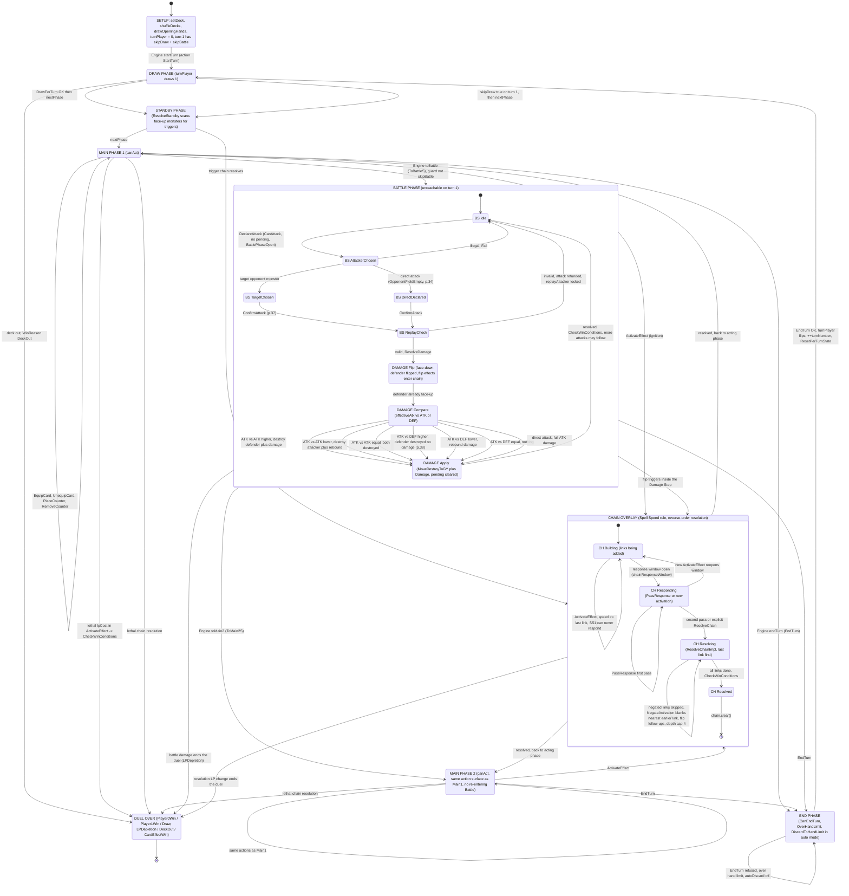

# The Game — one full state chart (start -> end)

> The entire game in one Mermaid diagram: setup, the repeating turn (Draw -> Standby ->
> Main1 -> Battle -> Main2 -> End, `turnPlayer` flipping each End), the battle walk, the
> chain overlay, and every route to a finished duel. First-turn initial conditions: turn 1
> has `skipDraw = true` and `skipBattle = true`, so its legal path is Draw(skip) ->
> Standby -> Main1 -> End.



## Legend — chart region -> source of truth

| Chart region | Source of truth |
|---|---|
| Setup / End / DuelOver | `engine/duel/Engine.hpp`, `DuelResult`/`WinReason` (`Duel.hpp`) |
| Draw / Standby / Main / End walk | `engine/protocol/DuelProtocol.hpp` (`Phase`, `nextPhase`, `canAct`) + `engine/action/Turn.hpp` |
| Battle composite | `engine/protocol/BattleProtocol.hpp` (`BattleStep`, `DamageStep`, `DamageOutcome`) + `engine/action/Battle.hpp` |
| Chain overlay | `engine/protocol/ChainProtocol.hpp` (`ChainStep`) + `engine/duel/Chain.hpp` + `engine/action/Chains.hpp` |
| Main-phase action self-loops | `engine/action/Summon.hpp`, `Move.hpp`, `Query.hpp` guards |

## First-turn special case (the "initial conditions")

```
turn 1 (turnPlayer = 0):
    skipDraw   = true  -> Draw Phase passes with no draw
    skipBattle = true  -> Battle Phase unreachable (ToBattleS refuses)
    => legal first turn: Draw(skip) -> Standby -> Main1 -> End
```
Every later turn is the identical walk for the other `turnPlayer` — the duel is literally
"one turn protocol, repeated, with `turnPlayer` flipped and `ResetPerTurnState` in between."
